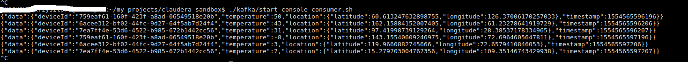
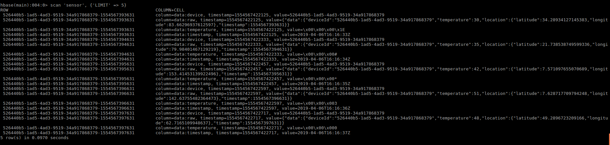
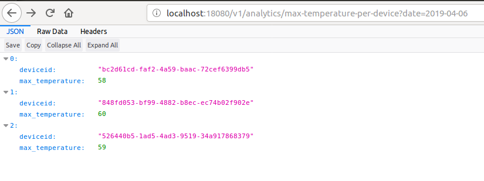

# cloudera-sandbox

## assumptions

For experiments Cloudera docker image (version 5.13) is downloaded from https://www.cloudera.com/downloads/quickstart_vms/5-13.html and built according to instructions as
```
sudo docker import - cloudera/quickstart:5.13.0-0-beta < cloudera-quickstart-vm-5.13.0-0-beta-docker.tar
```

Since by default Spark 1.6 is available code uses Java 1.7

## setup

To build project run:
```
./gradlew build shadowJar
```

Upon running `docker-compose up -d` experiment environment is started and set up. Necessary Hadoop components are created as per [scripts/init.sh](./scripts/init.sh). There following components are created:
 * [hbase table](./scripts/hbase-commands.txt))
 * [hive table](./scripts/create_sensor_data_table.sql)
 * impala is given access to hive table
 
 Application that generates sample data is automatically started. Frequency of sending events and number of sensors can be configured with properties. Kafka topic is automatically created.
 
 Data can be seen running [kafka-console-consumer](./kafka/start-console-consumer.sh), e.g.: 
 
 ## spark job
 
 To start a job writing data from kafka to hadoop run [run-spark-job](./spark/run-spark-job.sh) script. It will read data from `sensor-events` topic and write it to `sensor` HBase table.
 
 Sample row data that can be seen in HBase table: 
 
 ## querying data
 
 Generator application exposes few endpoints which allow to run sample queries using impala:
  * [max temperature per device](http://localhost:18080/v1/analytics/1)
  * [amount of points collected per device](http://localhost:18080/v1/analytics/2)
  * max temperature per device in given date, e.g. 
  
 Queries are defined in [properties file](./src/main/resources/application.properties)
